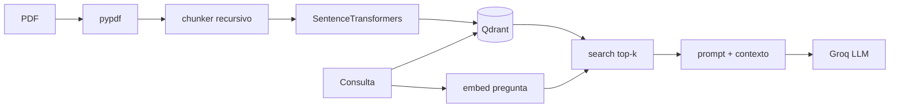

# mini-dojo-ai-3 — RAG sobre PDF (PoC didáctica)

Prueba de concepto **sin LangChain**: extracción de PDF → chunks → embeddings locales (Hugging Face / Sentence Transformers) → **Qdrant** → recuperación semántica → **Groq** como LLM.

## Requisitos

- Python **≥ 3.11**
- [uv](https://docs.astral.sh/uv/) para dependencias
- **Qdrant:** eligiendo una de estas opciones (no hace falta las dos):
  - Docker / Docker Compose para levantar Qdrant en tu máquina, **o**
  - URL de una instancia remota (Qdrant Cloud, servidor propio, etc.)
- Cuenta en [Groq](https://console.groq.com/) y API key

## Instalación

```bash
cp .env.example .env
# Editá .env (Groq obligatorio; Qdrant según la opción que elijas abajo)

uv sync
```

### Qdrant local (Docker)

Si querés el vector store en tu disco, sin depender de un servicio externo:

```bash
docker compose up -d
```

Por defecto la app usa `http://localhost:6333`. **Dashboard** (colecciones y puntos): [http://localhost:6333/dashboard](http://localhost:6333/dashboard).

### Qdrant remoto

Si ya tenés Qdrant en la nube o en otro host, **no levantes** el contenedor local y configurá en `.env`:

- `QDRANT_URL` — URL HTTPS del cluster o servidor (ejemplo: la que te da Qdrant Cloud).
- `QDRANT_API_KEY` — solo si tu instancia exige API key (típico en Qdrant Cloud); si es local sin auth, dejalo sin definir o comentado.

Opcionalmente podés fijar `QDRANT_COLLECTION` si no querés usar el nombre por defecto `pdf_chunks`.

El dashboard en ese caso depende del proveedor (por ejemplo el panel web de Qdrant Cloud), no de `localhost`.

Colocá un PDF en `data/` (por ejemplo `data/ejemplo.pdf`).

## Uso rápido

```bash
# Indexar (borra la colección anterior por defecto)
uv run python -m scripts.ingest data/tu-archivo.pdf

# Preguntar (top-k por defecto desde config)
uv run python -m scripts.query "¿Qué dice el documento sobre X?"
```

Opciones de ingest:

- `--keep-collection`: no borra la colección antes de subir puntos (ojo con IDs duplicados si ya indexaste).
- `--no-progress`: sin barra de progreso de embeddings.

## Notebook paso a paso

```bash
uv run jupyter notebook notebooks/rag_walkthrough.ipynb
```

El notebook importa `src/` y muestra: PDF, chunks, shape del vector (384), conteo en Qdrant, retrieval, prompt con contexto y comparativa **con / sin RAG**.

## Pipeline



## Configuración (`src/config.py` y `.env`)

| Variable / constante | Default | Descripción |
|----------------------|---------|-------------|
| `EMBEDDING_MODEL` | `paraphrase-multilingual-MiniLM-L12-v2` | Modelo local (384 dims) |
| `QDRANT_URL` | `http://localhost:6333` | Base URL del API REST Qdrant (local o remota) |
| `QDRANT_API_KEY` | *(vacío)* | API key si el servidor lo exige (p. ej. Qdrant Cloud) |
| `QDRANT_COLLECTION` | `pdf_chunks` | Nombre de la colección |
| `GROQ_MODEL` | `llama-3.3-70b-versatile` | Modelo en Groq |
| `CHUNK_SIZE` / `CHUNK_OVERLAP` | 500 / 50 | Tamaño de fragmentos |
| `TOP_K` | 4 | Fragmentos enviados al prompt |

## Estructura del código

- `src/pdf_loader.py` — lectura por página con `pypdf`
- `src/chunker.py` — división recursiva manual + overlap
- `src/embedder.py` — `SentenceTransformer.encode`, vectores normalizados
- `src/vector_store.py` — `QdrantClient`: colección, `upload_points`, `query_points`, `peek`
- `src/llm.py` — cliente `groq`
- `src/rag.py` — `ingest_pdf`, `answer`, `answer_without_rag`

Datos locales ignorados por git: `.env`, `qdrant_storage/`, `.venv`.

## Notas

- Los embeddings corren **en tu máquina**; la primera corrida descarga el modelo desde Hugging Face (opcional: `HF_TOKEN` para límites mejores).
- Groq usa **solo** la API para la generación final; los embeddings siguen siendo locales y Qdrant puede ser local (Docker) o remoto según configurés `QDRANT_URL`.
